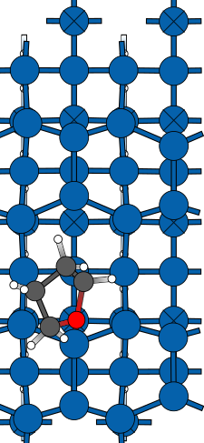
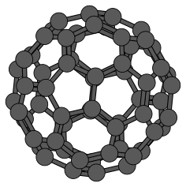
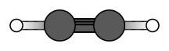
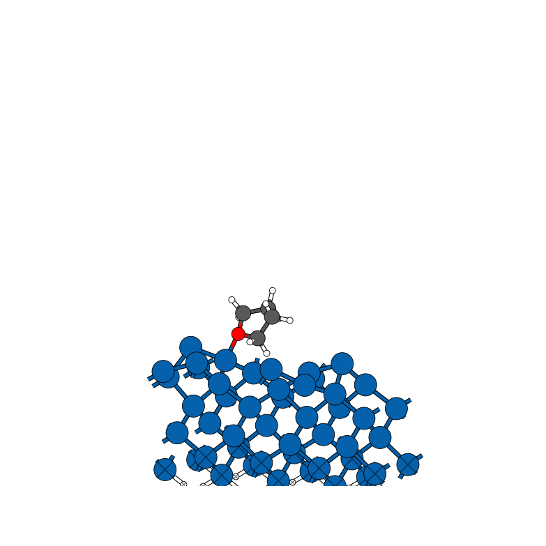
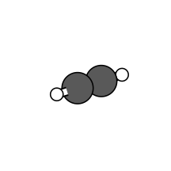

# Atoms_plotter
Package for plotting ASE atoms-objects using matplotlib. Can be used to create vector graphics, or used interactively in a jupyter-notebook.

## Installation
clone repository into Atoms_plotter
install with 
```
cd Atoms_plotter
python3 -m pip install -e . 
```
Ideally with a development install (-e) so changes are easily updated.

## Usage
* use installed entry point `plot_atoms`. See `plot_atoms --help` for options
### In a python script
Initialize the class; set options either when initialising or modify class attributes.
```python
from AtomsPlotter import atoms_plotter
from ase.io import read
from sys import argv
atoms=read(argv[1])
ap=atoms_plotter(atoms,show=True)
ap.plot()
```
### In a jupyter-notebook

```python
import ase
import ase.io
import matplotlib.pyplot
atoms=ase.io.read('CONTCAR')
%matplotlib widget #for interactive use
from AtomsPlotter import atoms_plotter

plotter=atoms_plotter(atoms=atoms, constraints=True)
plotter.dimension='3D'
plotter.plot()
```
#### some options
```python
plotter.atom_scale=0.5            # atoms drawn at this fraction of their covalent radius
plotter.inches_per_angstrom=0.4   # figure size per Angstrom of cell/structure
plotter.bondlinewidth=1           # multiplier of the default stick width
#plotter.scale=70                 # legacy: fixed marker size (points^2 per Angstrom radius)
plotter.colorbonds=True
plotter.constraints=False #draw constraints as x
plotter.draw_outline=True
plotter.repeat=[2,2] #repeat the unit cell in x,y (periodic structures)
plotter.use_bondorders=True #double/triple bonds
plotter.dimension='2D' #2D projection
plotter.plot()

#plot lewis-like structures. bonds as simple black lines, no atoms.

plotter.dimension='2D'
plotter.lewis=True
plotter.atoms.rotate(90, 'z',rotate_cell=True)
plotter.view=2
plotter.plot()
```

### Sizing
Figure size and atom/bond sizes are derived from the structure itself:
the figure is `inches_per_angstrom` inches per Angstrom of cell (or
molecule) extent, clamped so the longer edge stays between
`min_figsize` and `max_figsize` inches, and atoms are drawn with
`atom_scale` times their covalent radius in real-space units. The same
settings therefore give a uniform look across structures of any size.
Setting `scale` to a number restores the legacy behaviour where marker
sizes are a fixed number of points\^2 per Angstrom of covalent radius.

### Molecules
Structures without periodic boundary conditions are framed by the
bounding box of their atoms (plus their drawn radii), so a molecule is
always centered in the figure no matter where it sits in space. By
default molecules are also rotated onto their principal axes (largest
extent on x, smallest on z) so e.g. planar molecules are shown face-on
and linear molecules lengthwise; disable with `auto_orient=False`.

## Examples
`examples/` contains a few periodic POSCAR structures and, under
`examples/molecules/`, molecules from ASE's database, e.g.
```
plot_atoms examples/THF@Si.poscar
plot_atoms examples/molecules/C2H2.xyz
plot_atoms examples/molecules/C60.xyz -D 3D --elev 10 --azim 30
```
Rendered output for every example is in `examples/renders/`: plain 2D
(default settings, `plot_atoms <file>`) and a tilted 3D view
(`plot_atoms <file> -D 3D --elev 10 --azim 30`, saved as `*_3d.svg`).

| THF@Si | C60 | C2H2 |
| --- | --- | --- |
|  |  |  |
|  |  |  |

## Changelog

### 1.0.0

* Uniform sizing: figure size now scales with the cell/structure
  (`inches_per_angstrom`, clamped by `min_figsize`/`max_figsize`), and
  atom/bond sizes are computed in real-space units (`atom_scale`,
  `bondlinewidth` as stick-width multiplier). `scale` now defaults to
  `None`; pass a number for the legacy fixed point-based sizes.
* Molecules get a sensible default view: radius-aware bounding-box
  framing (centered wherever the molecule sits in space) and
  principal-axis auto-orientation (`auto_orient`).
* Frame computation fixed for non-orthogonal cells (previously only the
  diagonal of the cell was considered, cropping e.g. hexagonal cells);
  atoms sticking out of the cell are no longer cut off.
* `repeat` attribute of `atoms_plotter` is now actually used
  (previously documented but ignored); CLI `-r/--repeat` fixed (a
  precedence bug made it a no-op).
* CLI `--double_bonds`, `--triple_bonds`, `--double_bond_offset`,
  `--triple_bond_offset` are passed through correctly (previously set
  nonexistent attributes); removed broken empirical scaling of
  `scale`/`bondlinewidth` by the cell size and a stray debug print.
* `outline_width` constructor argument is honored (was hardcoded).
* Bond-order detection uses the correct periodic-image distance.
* 3D z-order is computed along the actual viewing direction
  (`elev`/`azim`), so occlusion is correct for any camera angle, not
  just the top-down view; 3D axes margins trimmed.
* Bond outlines are no longer drawn when `draw_outline=False`.
* `plot()` no longer mutates the supplied atoms object (cell of
  non-periodic structures used to be overwritten).
* CLI handles filenames containing `@` (e.g. `THF@Si.poscar`).
* New CLI options: `--atom_scale`, `--inches_per_angstrom`,
  `--auto_orient`, `-f/--format`; `-B/--bonds` is wired up.
* `from AtomsPlotter import atoms_plotter` works (package `__init__`).
* Added example molecules from ASE's database under
  `examples/molecules/` and a real test suite.

### 0.3.3

* Fix `plot_atoms_2D` / `plot_atoms_3D` colour assignment: elements
  missing from `color_dict` (e.g. `Au`, `Pt`) used to inherit the
  last-iterated atom's jmol colour because `self.COLORS` was rebuilt
  inside the per-atom loop with the outer-loop atomic number as the
  fallback. Now built once with a per-atom jmol fallback.
* Add `Au` (gold) to the default `color_dict`.
* Promote `plot_atom_colorscaling` to a real constructor keyword
  (`plot_atom_colorscaling=False` by default). Previously it was
  referenced from both render paths but the `__init__` assignment was
  commented out, so any code that hit the `color_dict=None` branch
  raised `AttributeError`.
* Guard the z-fraction colour scaling against `z_norm == 0` so flat
  (2-D) structures no longer divide by zero.
* Tidy four `ruff E702` (semicolon-chained statements) in `check_pbc`.

*(0.3.2 was prepared but never published — its scope is included
in 0.3.3 above.)*
